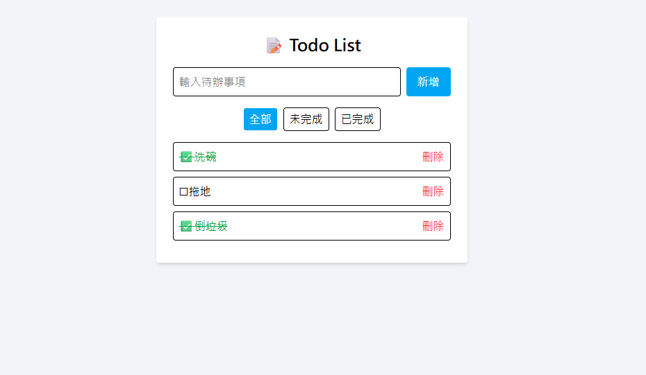

  <h2 align="center">TodoList</h2>
  本專案是一個 React Todo List 應用，使用 TypeScript、Tailwind CSS，並透過 `localStorage` 實現資料持久化。

 

### Demo Screeshots

## 專案結構

my-todo-app/
components/          # 可重複使用的元件
-AddTodo.tsx         # 新增任務的輸入框與按鈕
-TodoItem.tsx        # 單一任務顯示區塊（含勾選、刪除功能）
-ConfirmModal.tsx    # 確認彈窗元件

types/               # 自訂型別定義
-todo.ts             # Todo 資料結構定義

-App.tsx             # 主應用邏輯與畫面，包含列表顯示與過濾
-index.tsx           # 應用進入點（ReactDOM 渲染）
-index.css           # 全域樣式（含 Tailwind）
-ConfirmModal.scss   # 確認彈窗樣式
-tsconfig.json       # Tailwind CSS 設定
-package.json        # 專案依賴與指令

## 使用技術

- React
- typeScript
- Tailwindcss
- SCSS
- uuid 生成唯一識別碼
- localStorage 本地儲存任務資料

## 功能介紹

- ✅ 新增待辦事項
- ✅ 切換任務完成狀態
- ✅ 刪除待辦事項
- ✅ 任務狀態過濾（全部 / 未完成 / 已完成）
- ✅ 自動儲存資料至 `localStorage`
- ✅ Tailwind CSS 美化介面

## 進階功能介紹

- 刪除提示框(提醒使用者是否刪除此項目)
- 項目 hover 效果
- 沒有項目時，顯示目前沒有待辦事項
- 完成項目樣式效果